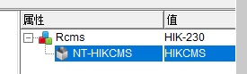
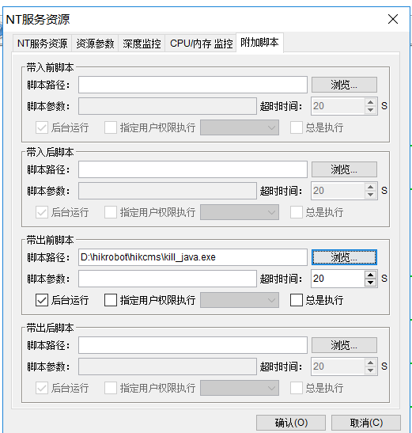

修改代码后需要将python转化为exe

```
pyinstaller -F -c kill_java.py
```

exe如何使用

将kill_java.exe放倒 D:\hikrobot\hikcms 文件夹中（与tomcat conf文件夹同级）



属性--附加脚本--带出前脚本--选择 D:\hikrobot\hikcms\kill_java.exe



确定后，测试一下。（两台服务器都需要上传exe到tomcat目录下）
